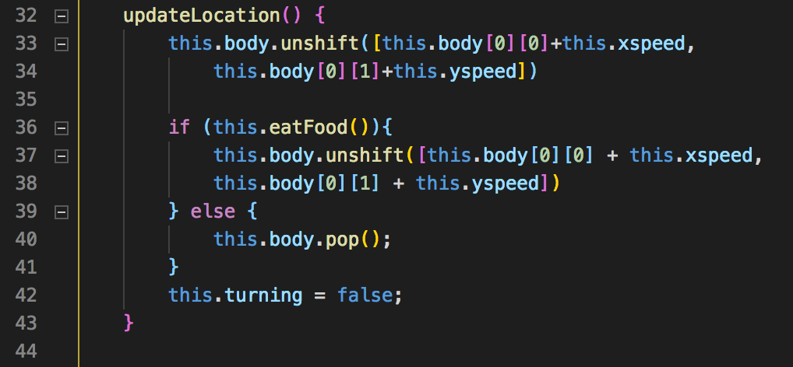
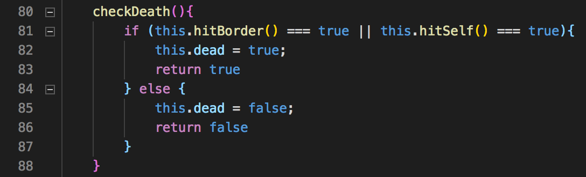
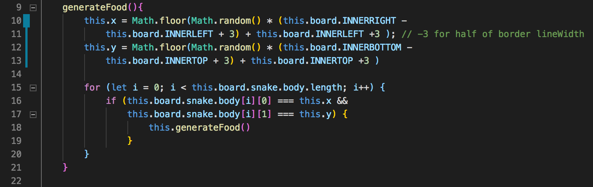

# RetroSnake


# Description

RetroSnake is a throwback to the snake game I used to play on a Nokia 3310 when I was a kid. RetroSnake mimics the functionality of the original snake game with a dot matrix style display overlay on top of a Nokia 3310 phone.

This project was built within a week. I do plan on implementing new features on this project over time. Features for planned release:
  1. Menu select
  2. Interactive button on phone overlay
  3. 2P game mode

# Features and Implementations

## Snake movement

Snake body is stored in an array and it moves on a 2D grid. The snake moves at a pace of 5 pixels per second and the animation is set at 15fps.

In order for a snake to appear to be moving, a new position of the head is shifted into the body array in the direction it is moving while the last position of the in the array is removed.

If snake eats food, the length of snake is increased. The length is increased by shifting a new coordinate into the snake body array.




## Snake rules

If the head of the snake touches either it's own body coordinates or the border, it is game over. It is accomplished by checking the x and y coordinates of the snake head with all of it's body coordinates and the border coordintes.




## Food random generator

Food is generated at a random x and y coordinate. However, the food has to be generated within the border and not in one of snake's body location. If the food generated does not comply within the above rules, it will generate a new random location by calling it's own function.




## Object Oriented Programing and Code Organization

Following good OOP practices, each class has it's own logic and each visible class has it's own ``` draw() ``` function. This was then called on by a parent class in order to comply with Law of Demeter.

An ``` index.js ``` file holds the page basic functionality and event listeners. Upon DOM-loaded, it creates a new instance of a game class in ``` game.js ``` . The ``` game ``` instance sets up the game parameter by calling other class. For example, the ``` Snake ``` class and ``` Food ``` class. The snake class is responsible in drawing the snake while the food class is responsible in drawing the food on the board.

By following this good practice, I am able to add new features and reduce debugging time as individual class is responsible for it's own function. Keeping up with this good practice will be a priority of mine when working on new and existing projects.


